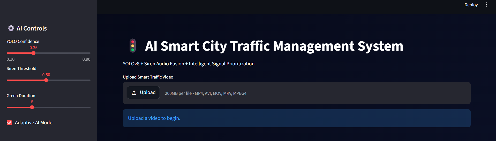
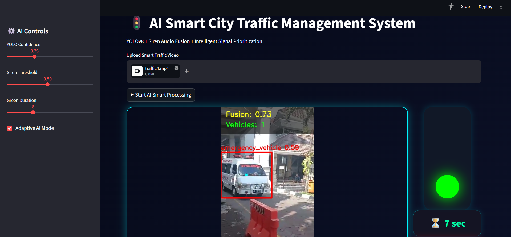
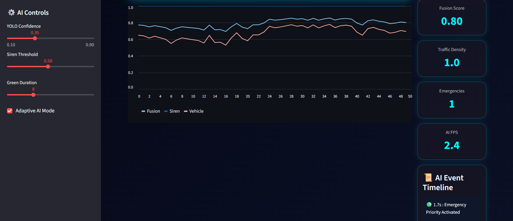

# 🚦 AI Smart City Traffic Management System

An AI-powered Smart Traffic Management System that detects emergency vehicles using **YOLOv8 Computer Vision** and **Siren Audio Fusion** to intelligently prioritize traffic signals in real time. The system helps reduce emergency response time by dynamically controlling traffic lights based on detected emergencies.

---

## ✨ Features

- 🚑 Emergency Vehicle Detection using YOLOv8
- 🔊 Siren Audio Detection & Fusion
- 🚦 Intelligent Traffic Signal Prioritization
- 📹 Real-time Video Processing
- 🎯 Adjustable Detection Confidence
- ⚡ Adaptive AI Mode
- 📊 Live Analytics Dashboard
- 📈 Real-time Fusion Score Graph
- 🚗 Vehicle Density Monitoring
- ⏱ Dynamic Green Signal Timer
- 📜 AI Event Timeline
- 🎛 Interactive AI Controls

---

# 📸 Screenshots

## Home Interface



---

## Emergency Vehicle Detection



---

## Live Analytics Dashboard



---

## 🛠 Tech Stack

### AI & Machine Learning

- Python
- YOLOv8
- OpenCV
- NumPy
- Pandas
- Ultralytics

### Audio Processing

- Librosa
- Sound Processing

### Visualization

- Plotly
- Streamlit

---

## 📂 Project Structure

```
EMERGENCY_VEHICLE_DETECTION
│
├── app
├── configs
├── dataset
├── final_dataset
├── models
├── outputs
├── raw_data
├── report
├── runs
├── scripts
├── screenshots
│   ├── home.png
│   ├── upload-video.png
│   ├── emergency-detection.png
│   └── analytics-dashboard.png
│
├── requirements.txt
├── README.md
└── render.yaml
```

---

## 🚀 Installation

Clone the repository

```bash
git clone https://github.com/ARADHYA200/EMERGENCY_VEHICLE_DETECTION.git
```

Install dependencies

```bash
pip install -r requirements.txt
```

Run the application

```bash
streamlit run app/app.py
```

---

## 📊 Project Highlights

- Detects emergency vehicles in uploaded traffic videos.
- Combines visual detection with siren audio analysis.
- Automatically prioritizes traffic signals.
- Displays real-time AI analytics and monitoring dashboard.
- Designed for smart city traffic management applications.

---

## 👨‍💻 Author

**Aradhya Agarwal**

GitHub: https://github.com/ARADHYA200

---

## ⭐ If you found this project useful, consider giving it a Star!