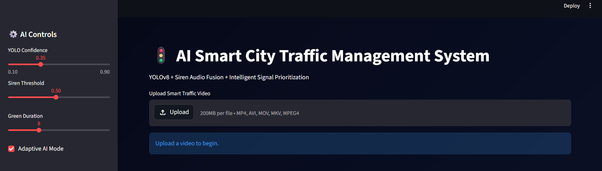
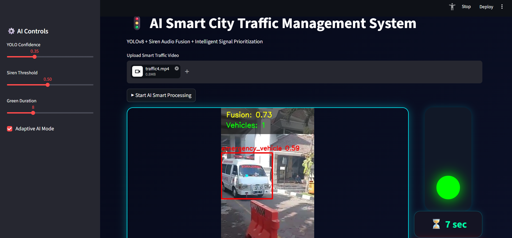
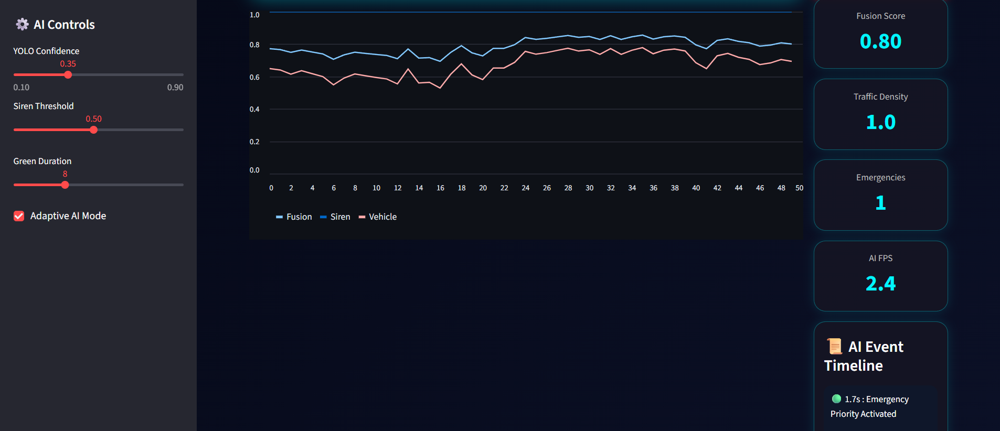

# 🚦 AI Smart City Traffic Management System

### Multimodal AI-Based Emergency Vehicle Detection & Traffic Signal Prioritization

An AI-powered **Smart City Traffic Management System** that combines **YOLOv8 Computer Vision** and **Siren Audio Classification** to detect emergency vehicles and intelligently prioritize traffic signals.

The system analyzes both **visual and audio evidence** to improve emergency-vehicle detection and dynamically assist traffic signal management, helping reduce delays for ambulances, fire trucks, and other emergency vehicles.

---

## 🌟 Why This Project?

Traditional traffic signals operate using fixed timings, which can cause unnecessary delays for emergency vehicles.

This project introduces a **multimodal AI approach** that combines visual vehicle detection with siren audio analysis.

```text
                    Traffic Video
                         │
              ┌──────────┴──────────┐
              │                     │
              ▼                     ▼
          YOLOv8              Audio Analysis
      Vehicle Detection         Siren CNN
              │                     │
              ▼                     ▼
       Visual Evidence       Siren Probability
              │                     │
              └──────────┬──────────┘
                         ▼
                  Fusion Engine
                         │
                         ▼
              Emergency Decision
                         │
                         ▼
             Traffic Prioritization
                         │
                         ▼
                  AI Dashboard
```

---

# ✨ Key Features

### 🚑 Emergency Vehicle Detection

* YOLOv8-based emergency vehicle detection
* Frame-by-frame traffic video processing
* Vehicle classification with confidence scores
* Adjustable detection confidence threshold

### 🔊 Siren Audio Detection

* Audio extraction and processing from traffic videos
* CNN-based siren classification
* Siren probability estimation
* Audio evidence used in emergency detection

### 🧠 Multimodal AI Fusion

Combines visual vehicle detection with audio siren analysis to make an emergency decision.

```text
Visual Detection
       +
Siren Detection
       ↓
  Fusion Logic
       ↓
Emergency Decision
```

### 🚦 Intelligent Traffic Signal Prioritization

* Emergency situation detection
* Traffic direction prioritization
* Dynamic green-signal timing
* Adaptive traffic management

### 📹 Video Processing

* Traffic video analysis
* Frame-by-frame object detection
* Real-time processing metrics
* Emergency-event tracking

### 📊 Live Analytics Dashboard

The Streamlit dashboard provides:

* Emergency vehicle count
* Vehicle density
* Siren probability
* Fusion score
* Detection confidence
* FPS
* Event timeline
* Traffic signal status

### 🎛 Interactive AI Controls

* Adjustable detection confidence
* Adaptive AI mode
* Interactive monitoring controls
* Real-time AI analytics

---

# 🧠 System Architecture

```text
                     ┌─────────────────────┐
                     │    Traffic Video    │
                     └──────────┬──────────┘
                                │
                   ┌────────────┴────────────┐
                   │                         │
                   ▼                         ▼
          ┌─────────────────┐       ┌─────────────────┐
          │     YOLOv8      │       │ Audio Extraction│
          │ Object Detection│       │   & Processing   │
          └────────┬────────┘       └────────┬────────┘
                   │                         │
                   ▼                         ▼
          ┌─────────────────┐       ┌─────────────────┐
          │ Emergency /     │       │   Siren CNN     │
          │ Vehicle Classes │       │   Classifier     │
          └────────┬────────┘       └────────┬────────┘
                   │                         │
                   │                         ▼
                   │                  Siren Probability
                   │                         │
                   └────────────┬────────────┘
                                ▼
                       ┌─────────────────┐
                       │  Fusion Engine  │
                       └────────┬────────┘
                                │
                                ▼
                     ┌────────────────────┐
                     │ Emergency Decision │
                     └─────────┬──────────┘
                               │
                 ┌─────────────┴─────────────┐
                 ▼                           ▼
       Traffic Prioritization          AI Analytics
                 │                           │
                 ▼                           ▼
        Dynamic Signal Control       Streamlit Dashboard
```

---

# 📊 Dataset

The project combines emergency-vehicle and normal-vehicle image data for object detection.

## 🚑 Emergency Vehicle Dataset

| Dataset            |     Train | Validation |     Total |
| ------------------ | --------: | ---------: | --------: |
| Ambulances         |       475 |         54 |       529 |
| Roboflow Ambulance |       700 |        200 |       900 |
| Roboflow Fire      |       454 |        129 |       583 |
| Roboflow Police    |       314 |          0 |       314 |
| **Total**          | **1,943** |    **383** | **2,326** |

## 🚗 Normal Vehicle Dataset

| Dataset  | Train | Validation | Total |
| -------- | ----: | ---------: | ----: |
| Vehicles | 2,937 |          0 | 2,937 |

### Overall Dataset

```text
Emergency Images : 2,326
Normal Images    : 2,937
--------------------------------
Total Images     : 5,263
```

The dataset preparation and merging workflow is implemented through the scripts in the `scripts/` directory.

---

# 🎯 YOLOv8 Model Performance

The trained YOLOv8 model was evaluated on **474 validation images containing 452 object instances**.

## Overall Detection Performance

| Metric    |    Result |
| --------- | --------: |
| Precision | **90.6%** |
| Recall    | **91.8%** |
| mAP@50    | **95.7%** |
| mAP@50-95 | **78.5%** |

### Class-wise Performance

| Class             | Precision |    Recall |    mAP@50 | mAP@50-95 |
| ----------------- | --------: | --------: | --------: | --------: |
| Emergency Vehicle |     90.8% |     86.4% | **94.3%** |     74.6% |
| Normal Vehicle    |     90.5% |     97.1% | **97.2%** |     82.4% |
| **Overall**       | **90.6%** | **91.8%** | **95.7%** | **78.5%** |

### YOLO Training Configuration

```text
Model       : YOLOv8n
Image Size  : 416 × 416
Batch Size  : 16
Epochs      : 20
Task        : Object Detection
```

Training configuration is maintained in:

```text
configs/data.yaml
```

Training script:

```text
scripts/train_yolo.py
```

Evaluation script:

```text
scripts/evaluate.py
```

---

# 🔊 Siren Classification Performance

A CNN-based binary classifier was trained to distinguish between **siren** and **non-siren** audio.

## Overall Performance

| Metric            |  Result |
| ----------------- | ------: |
| Accuracy          | **82%** |
| Macro F1-score    | **82%** |
| Weighted F1-score | **83%** |

### Class-wise Performance

| Class     | Precision | Recall | F1-score | Support |
| --------- | --------: | -----: | -------: | ------: |
| Non-Siren |       66% |   100% |      79% |      40 |
| Siren     |  **100%** |    74% |  **85%** |      80 |

The siren classifier provides an additional audio signal that is used by the multimodal fusion system.

Training:

```text
scripts/train_audio.py
```

Inference:

```text
scripts/audio_inference.py
```

---

# 🧠 Multimodal Fusion

The system combines two independent sources of evidence:

### Visual Evidence

```text
YOLOv8
   ↓
Vehicle Class
   +
Detection Confidence
```

### Audio Evidence

```text
Siren CNN
   ↓
Siren Probability
```

These signals are combined by the multimodal processing pipeline:

```text
             YOLOv8 Detection
                    │
                    │
                    ▼
              Visual Evidence
                    │
                    │
                    ├──────────────┐
                    │              │
                    ▼              ▼
             Fusion Engine    Siren Probability
                    ▲              ▲
                    │              │
                    └──────┬───────┘
                           │
                           ▼
                  Emergency Decision
```

This approach provides additional contextual information compared with relying only on visual object detection.

---

# 🚦 Traffic Signal Management

When an emergency situation is identified, the system prioritizes the corresponding traffic direction.

```text
Emergency Vehicle Detected
          ↓
   Validate Evidence
          ↓
 Emergency Decision
          ↓
Identify Traffic Direction
          ↓
 Prioritize Signal
          ↓
Dynamic Green Signal
```

The system also provides a dynamic green-signal timer and traffic-density information through the dashboard.

---

# 📈 Real-Time Analytics

The Streamlit dashboard provides real-time monitoring of:

| Metric                  | Purpose                            |
| ----------------------- | ---------------------------------- |
| Emergency Vehicle Count | Tracks detected emergency vehicles |
| Vehicle Density         | Monitors traffic load              |
| Siren Probability       | Measures audio evidence            |
| Fusion Score            | Represents multimodal evidence     |
| Detection Confidence    | Controls YOLO sensitivity          |
| FPS                     | Monitors processing performance    |
| Event Timeline          | Tracks AI events                   |
| Signal Timer            | Displays signal timing             |

---

# 📸 Screenshots

## 🏠 Home Interface



---

## 📹 Video Upload / Processing


---

## 🚑 Emergency Vehicle Detection



---

## 📊 Live Analytics Dashboard



---

# 🛠 Tech Stack

## Artificial Intelligence & Machine Learning

* Python
* YOLOv8
* Ultralytics
* TensorFlow / Keras
* OpenCV
* NumPy
* Pandas

## Audio Processing

* Librosa
* SoundFile
* CNN-based Siren Classification

## Visualization & Application

* Streamlit
* Plotly

## Deployment

* Render

---

# 📂 Project Structure

```text
EMERGENCY_VEHICLE_DETECTION/
│
├── app/
│   └── app.py
│
├── configs/
│   └── data.yaml
│
├── outputs/
│   └── metrics.txt
│
├── report/
│   └── report.md
│
├── screenshots/
│   ├── home.png
│   ├── upload-video.png
│   ├── emergency-detection.png
│   └── analytics-dashboard.png
│
├── scripts/
│   ├── audio_inference.py
│   ├── download_coco.py
│   ├── download_openimages.py
│   ├── download_urbansound.py
│   ├── evaluate.py
│   ├── merge_dataset.py
│   ├── multimodal_system.py
│   ├── prepare_yolo_dataset.py
│   ├── run_multimodal_demo.py
│   ├── train_audio.py
│   ├── train_yolo.py
│   └── video_detection.py
│
├── .gitignore
├── render.yaml
├── requirements.txt
├── run.bat
└── README.md
```

> Large datasets, generated training runs, and trained model weights are kept out of the Git repository where appropriate.

---

# 🚀 Installation

## 1. Clone Repository

```bash
git clone https://github.com/ARADHYA200/EMERGENCY_VEHICLE_DETECTION.git

cd EMERGENCY_VEHICLE_DETECTION
```

## 2. Create Virtual Environment

### Windows

```bash
python -m venv venv

venv\Scripts\activate
```

### Linux / macOS

```bash
python3 -m venv venv

source venv/bin/activate
```

## 3. Install Dependencies

```bash
pip install -r requirements.txt
```

## 4. Run the Application

```bash
streamlit run app/app.py
```

---

# ☁️ Deployment

The project includes a `render.yaml` configuration for deployment on **Render**.

The application can be started using:

```bash
streamlit run app/app.py --server.port=$PORT --server.address=0.0.0.0
```

---

# 🧩 Important Modules

| Module                    | Purpose                                         |
| ------------------------- | ----------------------------------------------- |
| `app/app.py`              | Streamlit application and interactive dashboard |
| `train_yolo.py`           | YOLOv8 model training                           |
| `train_audio.py`          | Siren CNN training                              |
| `audio_inference.py`      | Siren model inference                           |
| `multimodal_system.py`    | Visual + audio multimodal processing            |
| `run_multimodal_demo.py`  | End-to-end multimodal demonstration             |
| `video_detection.py`      | Video-based vehicle detection                   |
| `evaluate.py`             | Model evaluation                                |
| `prepare_yolo_dataset.py` | YOLO dataset preparation                        |
| `merge_dataset.py`        | Dataset merging                                 |
| `data.yaml`               | YOLO dataset configuration                      |

---

# 📌 Project Highlights

* Built a **multimodal AI system** combining computer vision and audio classification.
* Trained a **YOLOv8 object detector** achieving **95.7% mAP@50** and **90.6% precision**.
* Developed a **CNN-based siren classifier** achieving **82% classification accuracy**.
* Combined visual and audio evidence using a **multimodal fusion pipeline**.
* Implemented emergency-focused **traffic signal prioritization** and dynamic green-signal timing.
* Processed traffic videos frame-by-frame using OpenCV and YOLOv8.
* Developed an interactive **Streamlit analytics dashboard** for real-time AI monitoring.
* Monitored vehicle density, siren probability, fusion scores, FPS, events, and signal status.
* Prepared and combined **5,263 images** across emergency and normal vehicle datasets.

---

# 🔮 Future Improvements

* Multi-camera traffic monitoring
* Real-time CCTV stream integration
* Learned multimodal fusion model
* Additional emergency vehicle classes
* Edge-device deployment
* Real traffic signal hardware integration
* Model optimization for faster inference
* Automated model retraining pipeline
* Cloud-based traffic monitoring

---

# 📄 Project Report

Detailed project documentation is available in:

[Project Report](report/report.md)

---

# 👨‍💻 Author

**Aradhya Agarwal**

B.Tech — Electronics & Communication Engineering
Dr. B. R. Ambedkar National Institute of Technology, Jalandhar

GitHub:
https://github.com/ARADHYA200

---

## ⭐ If you found this project useful, consider giving it a Star!
